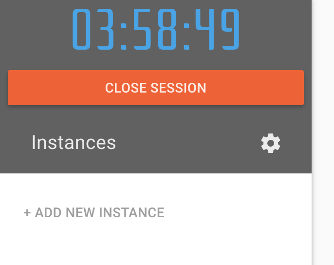
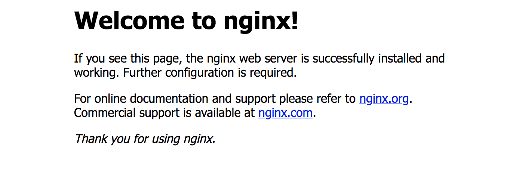

# 第一次使用 Play with Kubernetes

### Play with Kubernetes

這個世間就是這麼漂亮，都有此 PWK 工具網站可以練習 K8s  
此網站工具僅需具備 github or Docker 帳號即可登入使用～  
登入後，先點選左邊畫面 _**+ ADD NEW INSTANCE**_，新增節點



### 初始化

新增後，Terminal 中就有初始化說明

```bash
 1. Initializes cluster master node:
 kubeadm init --apiserver-advertise-address $(hostname -i)

 2. Initialize cluster networking:
 kubectl apply -n kube-system -f "https://cloud.weave.works/k8s/net?k8s-version=$(kubectl version | base64 |tr -d '\n')"

 3. (Optional) Create an nginx deployment:
 kubectl apply -f https://raw.githubusercontent.com/kubernetes/website/master/content/en/examples/application/nginx-app.yaml


                        The PWK team.
```

### Node join

開始進行基本初始化步驟 1

```bash
 1. Initializes cluster master node:
 kubeadm init --apiserver-advertise-address $(hostname -i)
 
    ........<忽略>........

[addons] Applied essential addon: CoreDNS
[addons] Applied essential addon: kube-proxy

Your Kubernetes master has initialized successfully!

```

完成 Master\work node 基礎節點之後，進行步驟 2

```bash
# 2. Initialize cluster networking:
[node1 ~]$ kubectl apply -n kube-system -f "https://cloud.weave.works/k8s/net?k8s-version=$(kubectl version | base64 |tr -d '\n')"
 
serviceaccount/weave-net created
clusterrole.rbac.authorization.k8s.io/weave-net created
clusterrolebinding.rbac.authorization.k8s.io/weave-net created
role.rbac.authorization.k8s.io/weave-net created
rolebinding.rbac.authorization.k8s.io/weave-net created
daemonset.extensions/weave-net created
[node1 ~]$
```

當完成上面步驟 1.`Initializes cluster master node`之後，此 instance 即成為 **Master node**  
步驟完成後，會提供`kubectl join`指令（如下）  
`kubeadm join 192.168.0.13:6443 --token 6bcc6s.zkvi8hv0hhpxkd1v --discovery-token-ca-cert-hash sha256:9ceb947c39b2a4e10396d846dfda4cba9d27958ee687eb9b406cff0400f27223`  
  
此時於左邊環境繼續 _**+ ADD NEW INSTANCE**_，例如新增三個 K8s node  
透過`kubectl join`指令將三個新 instance join 到第一台 instance 成為 work-nodes。  
新增後，在 Master node 上，查看資訊：

```bash
[node1 ~]$ kubectl get node
NAME      STATUS    ROLES     AGE       VERSION
node1     Ready     master    4m        v1.11.3
node2     Ready     <none>    2m        v1.11.3
node3     Ready     <none>    1m        v1.11.3
node4     Ready     <none>    58s       v1.11.3
[node1 ~]$
```

### 部署範例 Nginx 

當進行 Create an nginx deployment 時，就會依據此 nginx-app.yaml 進行創建 deployment、service、endpoint、pod 等角色物件。

```bash
[node1 ~]$ kubectl apply -f https://raw.githubusercontent.com/kubernetes/website/master/content/en/examples/application/nginx-app.yaml

  service/my-nginx-svc created
  deployment.apps/my-nginx created
[node1 ~]$

# 創建 services、pod 初期 pending 狀態
[node1 ~]$ kubectl get services
NAME           TYPE           CLUSTER-IP      EXTERNAL-IP   PORT(S)        AGE
kubernetes     ClusterIP      10.96.0.1       <none>        443/TCP        8m
my-nginx-svc   LoadBalancer   10.107.145.35   <pending>     80:30997/TCP   28s

[node1 ~]$ kubectl get pods
NAME                        READY     STATUS              RESTARTS   AGE
my-nginx-67594d6bf6-f94cb   0/1       ContainerCreating   0          42s
my-nginx-67594d6bf6-tfpg5   0/1       ContainerCreating   0          42s
my-nginx-67594d6bf6-trps7   0/1       ContainerCreating   0          42s

# 完成創建 pod 後狀態：Running
[node1 ~]$ kubectl get pods
NAME                        READY     STATUS    RESTARTS   AGE
my-nginx-67594d6bf6-f94cb   1/1       Running   0          1m
my-nginx-67594d6bf6-tfpg5   1/1       Running   0          1m
my-nginx-67594d6bf6-trps7   1/1       Running   0          1m

```

完成部署此服務時，透過 kubectl 取得各物件資訊

```bash
# deployments
[node1 ~]$ kubectl get deployments
NAME       DESIRED   CURRENT   UP-TO-DATE   AVAILABLE   AGE
my-nginx   3         3         3            3           1m

# services
[node1 ~]$ kubectl get services
NAME           TYPE           CLUSTER-IP      EXTERNAL-IP   PORT(S)        AGE
kubernetes     ClusterIP      10.96.0.1       <none>        443/TCP        9m
my-nginx-svc   LoadBalancer   10.107.145.35   <pending>     80:30997/TCP   1m
[node1 ~]$

# endpoints
[node1 ~]$ kubectl get endpoints -o wide
NAME           ENDPOINTS                                AGE
kubernetes     192.168.0.13:6443                        19m
my-nginx-svc   10.32.0.2:80,10.40.0.2:80,10.44.0.2:80   10m
[node1 ~]$

# pods
[node1 ~]$
[node1 ~]$ kubectl get pods -o wide
NAME                        READY     STATUS    RESTARTS   AGE       IP          NODE      NOMINATED NODE
my-nginx-67594d6bf6-f94cb   1/1       Running   0          10m       10.44.0.2   node3     <none>
my-nginx-67594d6bf6-tfpg5   1/1       Running   0          10m       10.40.0.2   node2     <none>
my-nginx-67594d6bf6-trps7   1/1       Running   0          10m       10.32.0.2   node4     <none>

```

完成部署後，在 “Play with Kubernetes” 介面上有個隨機性數字 [30997 藍色](http://ip172-18-0-35-bfi2iocgi22g00auk1vg-30997.direct.labs.play-with-k8s.com/)連結  
ps. 此藍色數字，是依據 Services 所隨機配置的外部 PORT。  
點選連結後，即可看見 Nginx 服務的歡迎畫面。



