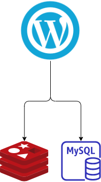
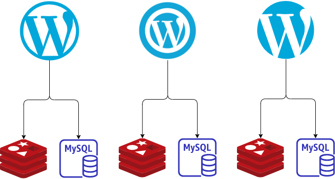

# 同環境，一次部署多個相同App

在我的 K8s 環境中，需要部署同一個 app 在同一個環境中，並且是兩個同時運作，說到這，像是 pod replicas 機制就可完成，但並非如此～

### 應用情境

我先說一個 wordpress 網站，使用 Helm 部署時，架構呈現與 Chart 資訊：

#### 網站架構



#### Chart 資訊

Helm Chart 文件概要如下：  
wordpress-deployment \ wordpress-service \ redis-deployment \ mysql-deployment  
以下 yaml 範例走 _極簡風_，沒去呈現 Kubernetes 相關元件的基本概要。

```yaml
# wordpress/charts/templates/wordpress.yaml
#---------------------------------
# wordpress-deployment
apiVersion: apps/v1
kind: Deployment
metadata:
  name: wordpres
#---------------------------------
# wordpress-service
apiVersion: v1
kind: Service
metadata:
  name: wordpress
#---------------------------------
# redis-deployment
apiVersion: apps/v1
kind: Deployment
metadata:
  name: redis
#---------------------------------
# mysql-deployment
apiVersion: apps/v1
kind: Deployment
metadata:
  name: mysql
#---------------------------------

```

上述 Helm wordpress chart 可以完成單一網站服務的部署。（_極簡風下的假設性_）  
網址是：www.wp104.com

那回歸主題，我要部署十個.....不不不，是三個，三個就好。  
網址如下：

* www.wp104.com
* www.wp111.com
* www.wp591.com

### 議題

#### 相同的 App 相同的架構，甚至就是相同的 templates yaml file ～ 我還要將上述的 charts/templates/\*.yaml 複製成三份並且個別名稱唯一性嗎？

我要部署三個 wordpress 網站，不同的網站內容，各有各自客群，架構圖說明如下：



### 解決方案

目前我所知的有兩項：

1. templates yaml 套用 range 函數
2. 透過 requirements alias 匿名

#### range 函數

Helm 提供了 range 函數功能，此功能達到 “for each” 循環功能概念。  
templates 中引用 range 函數與透過 values.yaml 內容指定的陣列變數，給予產出副本、清單之類的 K8s 文件。

我將上述的 templates `wordpress.yaml` 引用 range 函數如下，搭配 values file。

```yaml
# wordpress/charts/templates/wordpress.yaml
#---------------------------------
# wordpress-deployment
{{- range .Values.wp }}
apiVersion: apps/v1
kind: Deployment
metadata:
  name: {{ . }}-wordpres
#---------------------------------
# wordpress-service
apiVersion: v1
kind: Service
metadata:
  name: {{ . }}-wordpress
#---------------------------------
# redis-deployment
apiVersion: apps/v1
kind: Deployment
metadata:
  name: {{ . }}-redis
#---------------------------------
# mysql-deployment
apiVersion: apps/v1
kind: Deployment
metadata:
  name: {{ . }}-mysql
---
{{- end }}

```

```yaml
# wordpress/charts/values.yaml
#---------------------------------
# values 上下文省略
enabled: true
wp: [wp104,wp111,wp591]

# values 上下文省略
```

說明：  
`{{- range .Values.wp }}` 指定取得 values.yaml 內容中陣列值的來源參數。  
`{{ . }}` 引用陣列參數該階層的內容。

#### Requirements Alias

在 requirements 內容中引述對象的是 chart，給個 chart 都有指定來源、版本資訊，內容如下

```text
dependencies:
  - name: wordpress
    version: 1.0.1
```

再加上 alias 敘述，可以引用相同的 repository 來源，並定義不同的 alias name。  
內容如下：

```text
dependencies:
  - name: wordpress
    version: 1.0.1
    repository: "file://wordpress"
    condition: wp104.enable
    alias: wp104
    
  - name: wordpress
    version: 1.0.1
    repository: "file://wordpress"
    condition: wp111.enable
    alias: wp111
    
  - name: wordpress
    version: 1.0.1
    repository: "file://wordpress"
    condition: wp591.enable
    alias: wp591

```

values.yaml 內容，加上搭配 dependencies.condition 如下：

```yaml
# wordpress/charts/values.yaml
#---------------------------------
# values 上下文省略
wp104:
  enabled: true

wp111:
  enabled: true

wp591:
  enabled: true
# values 上下文省略
```

當然你也可在不同的 wp 階層內，定義各別不同的參數在其中，就更加符合產品需求。

### 小結論

上述兩個方式，都能達成同一個環境建立 \[數個相同app\] 的目的，尤其是 requirements 方法再搭配 values 個別自定義的參數於 app 其中，就能夠產出不同功能的 app。

