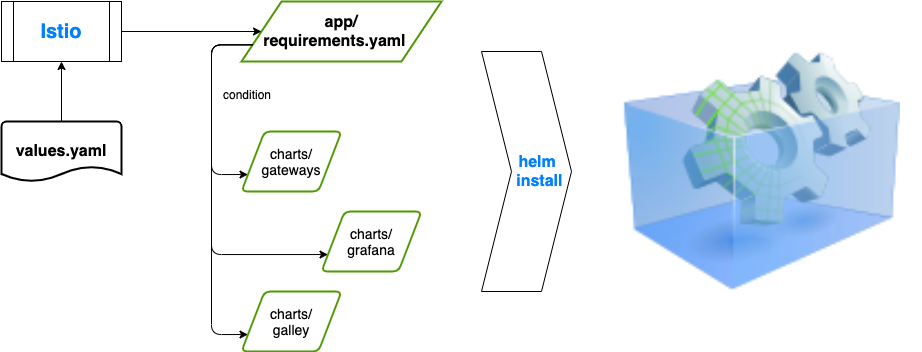

# Helm requirements.yaml 見解

有使用 Helm 套件來管理 Kubernetes 應用服務的人都知道，應用服務是被封裝在 Helm Chart 之中。

### Helm requirements 什麼用途

Helm Chart 基本用途就是單一應用服務的套件包概念，如同在使用 CentOS 中安裝單一套件概念依樣（yum install httpd），但如果有數個應用服務搭建成一套完整性系統，就需要多個 Chart，為此管理方便，便有了 requirements 相依性設計概念。

例如：我需要完整一套網站服務平台，需要「網站伺服器、快取服務、負載平衡服務、資料庫服務」，那就需要這些 chart：Nginx、PHP、Redis、HAProxy、MySQL 等等，  
如果，你不想一個一個獨立安裝，則可以在主要的 chart 中建立 requirements.yaml 進行相依性管理，即可一次安裝上述服務套件。（此段敘述是我舉例。）

### Istio Chart 範例

我從 Istio Chart 範例中呈現：Chart 結構、requirements.yaml 內容


```yaml
dependencies:
  - name: gateways
    version: 1.4.3
    condition: gateways.enabled
  - name: mixer
    version: 1.4.3
    condition: or mixer.policy.enabled mixer.telemetry.enabled
  - name: pilot
    version: 1.4.3
    condition: pilot.enabled
  - name: grafana
    version: 1.4.3
    condition: grafana.enabled
  - name: prometheus
    version: 1.4.3
    condition: prometheus.enabled
  - name: tracing
    version: 1.4.3
    condition: tracing.enabled
  - name: galley
    version: 1.4.3
    condition: galley.enabled
  - name: kiali
    version: 1.4.3
    condition: kiali.enabled
# 以上僅是截取部分內容
```

再來是 Istio values.yaml 內容：

```yaml
# Gateways Configuration, refer to the charts/gateways/values.yaml
# for detailed configuration
#
gateways:
  enabled: true

#
# addon grafana configuration
#
grafana:
  enabled: false

#
# addon prometheus configuration
#
prometheus:
  enabled: true

#
# addon jaeger tracing configuration
#
tracing:
  enabled: false

#
# addon kiali tracing configuration
#
kiali:
  enabled: false

#
# galley configuration, refer to charts/galley/values.yaml
# for detailed configuration
#
galley:
  enabled: true

# 以上僅是截取部分內容
```

上述的 values.yaml 明確擷取出 Chart 的關鍵資訊：`enabled: true \ false`  
此部分影響著，該套件服務是否安裝。

### Chart \ requirements \ values 三項相依關係



### 最近重新認識了 Helm requirements.yaml 資訊面向

#### 實務心得1：

values.yaml 內容中的第一階層：`gateways、grafana...galley` 等等，是呼應到Chart name，也是等同 requirements.yaml 內容中的 `dependencies.name`。

另外，如在 requirements 內容中定義了 `alias` 別名概念，則 values.yaml 內容中第一階層名稱 `gateways` 對應到 requirements.yaml 內容中的 `dependencies.alias`。

```yaml
# values.yaml 內容
# Gateways Configuration, refer to the charts/gateways/values.yaml
# for detailed configuration
#
gateways:
  enabled: true # 呼應 requirements.yaml condition

~~~~~~~~~~~~~~~~~~~~~~~~~~~~~~~~~~~~~~~~~
# requirements.yaml 內容
dependencies:
  - name: gateways
    condition: gateways.enabled

~~~~~~~~~~~~~~~~~~~~~~~~~~~~~~~~~~~~~~~~~
# 應用 alias 的 requirements.yaml 內容
dependencies:
  - name: app-gateways
    condition: gateways.enabled
    alias: gateways
    
```

#### 實務心得2：

來看下 Istio gateway chart 內容中的 templates/serviceaccount.yaml 設計

```yaml
{{- range $key, $spec := .Values }}
{{- if ne $key "enabled" }}
{{- if $spec.enabled }}
apiVersion: v1
kind: ServiceAccount
metadata:
  name: {{ $key }}-service-account
  namespace: {{ $spec.namespace | default $.Release.Namespace }}
  labels:
    app: {{ $spec.labels.app }}

# 以下省略
```

這裡使用兩個變數`$key \ $spec`作為**鍵組合**值，來呼應 values.gateways 裡頭定義了複數個元件服務：`istio-ingressgateway \ istio-egressgateway`。

這時合理的 values 內容如下：

```yaml
gateways:
  enabled: true
  istio-ingressgateway:
    enabled: true
  istio-egressgateway:
    enabled: true

```

#### 我的實務錯誤省思

當時我為了設定參數`externalTrafficPolicy`，故使用了以下的 values 內容

```yaml
gateways:
  enabled: true
  externalTrafficPolicy: Local

```

執行了指令：`helm install istio.io/istio -f ./values.yaml --dry-run --debug`  
出現以下錯誤訊息：

```yaml
Error: INSTALL FAILED: render error in "istio/charts/gateways/templates/serviceaccount.yaml": template: istio/charts/gateways/templates/serviceaccount.yaml:3:12: executing "istio/charts/gateways/templates/serviceaccount.yaml" at <$spec.enabled>: can't evaluate field enabled in type interface {}
```

會出現錯誤的原因在於 values.yaml 內容中第三行`externalTrafficPolicy: Local`  
在 `gateways` 作為第一階 values，`externalTrafficPolicy` 則被視為第二階 values，回顧上述 **實務心得2** 會發現，第二階代表著 $key，並且 helm 會解析 enabled 參數。

> **很明顯，會出錯的原因就是誤將第二階設定為 key-value 組合鍵，helm 解析失敗。**

這次的錯誤，讓我重新認識了 helm values \ requirements \ chart 三方的關聯。  
學習到 Istio 如何應用多個 chart 應用套件來部署 ISTIO 環境。  


