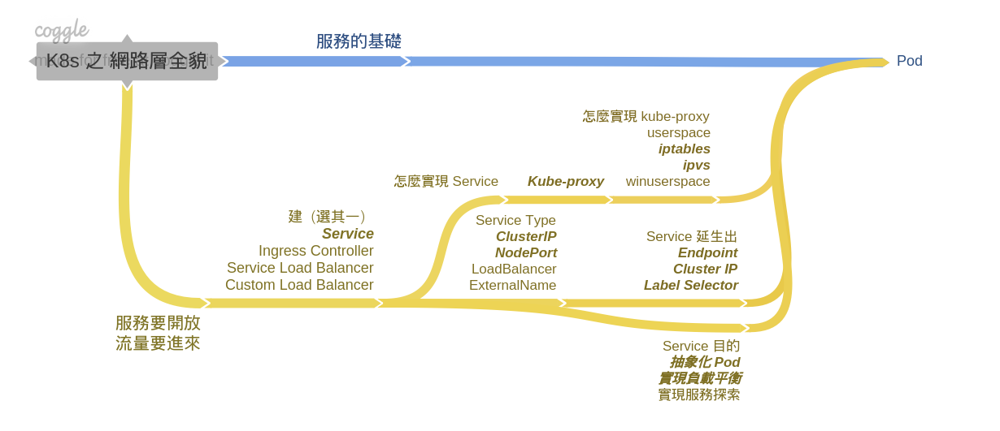

# 從 Service 發現 K8s 網路層全貌

過去幾篇，都是依著書本內容及基本概念去研讀，並不是照著書本的篇章依序研讀  
我從 K8s 的基本元件認知 &gt; 透過 minikube demo性質實作，探討必要物件  
相關觀念與物件 &gt; Pod 的細節 &gt; Service 的細節 等邏輯順序。

尤其是 Service 細節，直到研讀上一篇內容時，才初見 K8s 網路層全貌，我用心智圖方式來呈現全貌：

* 全貌心智圖中，_**粗斜體字**_代表著過往文章有提到過，有淺談過，也有少部分 demo
* 但也有部分是輕輕帶過，因為真的還不懂，話不能亂說 XD
* 沒提到過的，未來也不確定一定談論，畢竟我的著眼點在：
  * 基本觀念、基本角色物件、主流用法、工作上會碰上。

以上，都是從概念性去認識 K8s，所以一直不是很深層的技術文章，所以...希望以後再深入 K8s 實作。

