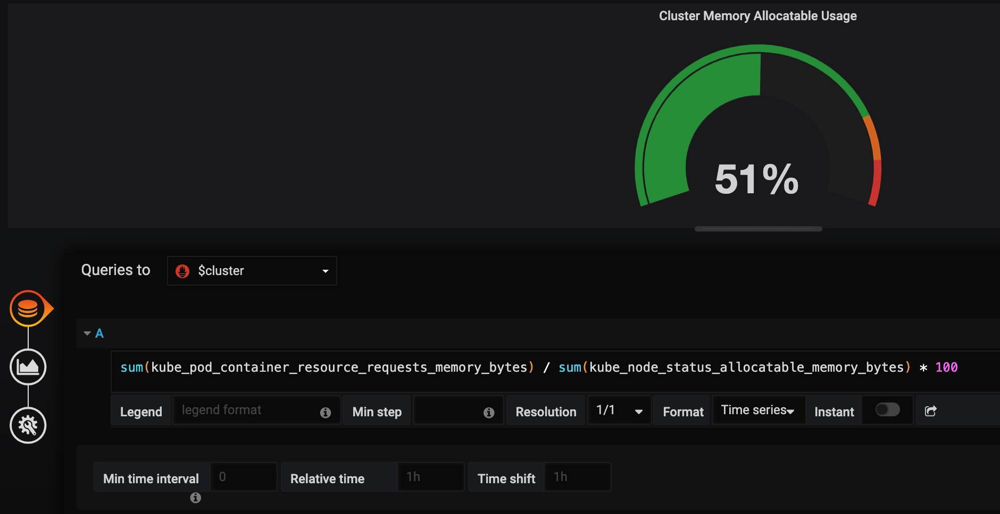

# 今日來介紹 Pod 靜態文件～ Manifest

### 認識 Manifest 檔案

此文件用來定義 Pod，以文字宣告方式表達出 Pod 所有的面貌，該文件以 YAML or JSON 兩格式其一來呈現。 可以來透過現有 Pod 來取得該資源 manifest file。   
指令如下：

```bash
[user@minikube ~]$ kubectl get pod
NAME                              READY   STATUS    RESTARTS   AGE
hello-minikube-7c77b68cff-ncqmn   1/1     Running   1          4d
[user@minikube ~]$ kubectl get pod hello-minikube-7c77b68cff-ncqmn -o yaml
# 內容很多，以下面圖片替代～
```



### manifest 檔案說明

* `apiVersion:`  &lt;API版本&gt;
* `kind:` &lt;資源名稱&gt; 
* `metadata:` &lt;物件名稱&gt; 
* `spec:` &lt; containers 面貌&gt; 
* `status:`&lt;運作狀態&gt;

### 用 Manifest 部署，範例

**部署 pod 也可以透過 manifest 檔案進行**

舉下面例子建立複製版 hello-minikube，稱呼為 hello-kitty**，**先建立 kk8s/hello-kitty.yaml file

```bash
apiVersion: v1
kind: Pod
metadata:
  labels:
    run: hello-minikube
  name: hello-kitty
  namespace: default
spec:
  containers:
  - image: k8s.gcr.io/echoserver:1.10
    name: hello-kitty
    ports:
    - containerPort: 8081
      protocol: TCP
```

#### 透過 kubectl apply 指令進行 hello-kitty 部署

```bash
[user@minikube ~]$ kubectl apply -f kk8s/hello-kitty.yaml
pod/hello-kitty created

[user@minikube ~]$ kubectl get pod -o wide
NAME                              READY   STATUS    RESTARTS   AGE   IP           NODE
hello-kitty                       1/1     Running   0          14s   172.17.0.6   minikube
hello-minikube-7c77b68cff-ncqmn   1/1     Running   1          5d    172.17.0.4   minikube
```

#### 透過 manifest 檔案建立 deployment 物件

透過 manifest 檔案部署 hello-moto deployments 物件，先建立 kk8s/hello-moto-deployment.yaml 檔案

```bash
apiVersion: extensions/v1beta1
kind: Deployment
metadata:
  annotations:
    deployment.kubernetes.io/revision: "1"
  labels:
    run: hello-moto
  name: hello-moto
  namespace: default
spec:
  replicas: 1
  selector:
    matchLabels:
      run: hello-moto
  strategy:
    rollingUpdate:
      maxSurge: 25%
      maxUnavailable: 25%
    type: RollingUpdate
  template:
    metadata:
      labels:
        run: hello-moto
    spec:
      containers:
      - image: k8s.gcr.io/echoserver:1.10
        name: hello-moto
        ports:
        - containerPort: 8080
          protocol: TCP
      dnsPolicy: ClusterFirst
      restartPolicy: Always
```

#### 透過 kubectl apply 指令進行 hello-moto deployments 部署

```bash
[user@minikube ~]$ kubectl apply -f kk8s/hello-moto-deployment.yaml
deployment.extensions/hello-moto created

[user@minikube ~]$ kubectl get pods -o wide
NAME                              READY   STATUS    RESTARTS   AGE   IP           NODE
hello-kitty                       1/1     Running   0          10m   172.17.0.6   minikube
hello-minikube-7c77b68cff-ncqmn   1/1     Running   1          5d    172.17.0.4   minikube
hello-moto-6456dff9f-67jh5        1/1     Running   0          6s    172.17.0.7   minikube

[user@minikube ~]$ kubectl get deployments -o wide
NAME             DESIRED   CURRENT   UP-TO-DATE   AVAILABLE   AGE   CONTAINERS       IMAGES                       SELECTOR
hello-minikube   1         1         1            1           5d    hello-minikube   k8s.gcr.io/echoserver:1.10   run=hello-minikube
hello-moto       1         1         1            1           27s   hello-moto       k8s.gcr.io/echoserver:1.10   run=hello-moto
[user@minikube ~]$
```

有沒有發現，deployment 物件只出現 hello-moto，卻沒有 hello-kitty ～  
因為，在建立 hello-moto depolyment 物件時，manifest 檔案中有宣告 pod 物件。  
意即，建立 hello-moto depolyment 物件時同時也建立相對應的 pod 物件。

#### 接著進行 “hello-moto” service 部署

```bash
[user@minikube ~]$ kubectl expose deployment hello-moto --type=NodePort
service/hello-moto exposed
[user@minikube ~]$ kubectl get services -o wide
NAME             TYPE        CLUSTER-IP      EXTERNAL-IP   PORT(S)          AGE   SELECTOR
hello-minikube   NodePort    10.97.219.147   <none>        8080:31472/TCP   5d    run=hello-minikube
hello-moto       NodePort    10.101.39.213   <none>        8080:32049/TCP   17s   run=hello-moto
kubernetes       ClusterIP   10.96.0.1       <none>        443/TCP          6d    <none>
```

#### 驗證 hello-kitty 是否有回應

```bash
[user@minikube ~]$ curl $(minikube service hello-moto --url)

Hostname: hello-moto-6456dff9f-67jh5

Pod Information:
	-no pod information available-

Server values:
	server_version=nginx: 1.13.3 - lua: 10008

Request Information:
	client_address=172.17.0.1
	method=GET
	real path=/
	query=
	request_version=1.1
	request_scheme=http
	request_uri=http://192.168.99.100:8080/

Request Headers:
	accept=*/*
	host=192.168.99.100:32049
	user-agent=curl/7.47.0

Request Body:
	-no body in request-

[user@minikube ~]$ 
```

#### 以上，簡單的示範如何透過 manifest 檔案建立物件與服務，藉此認識 manifest !


_**謎之音**_：pod 建立完之後，怎麼建立相對應的 deployment 物件呢？


