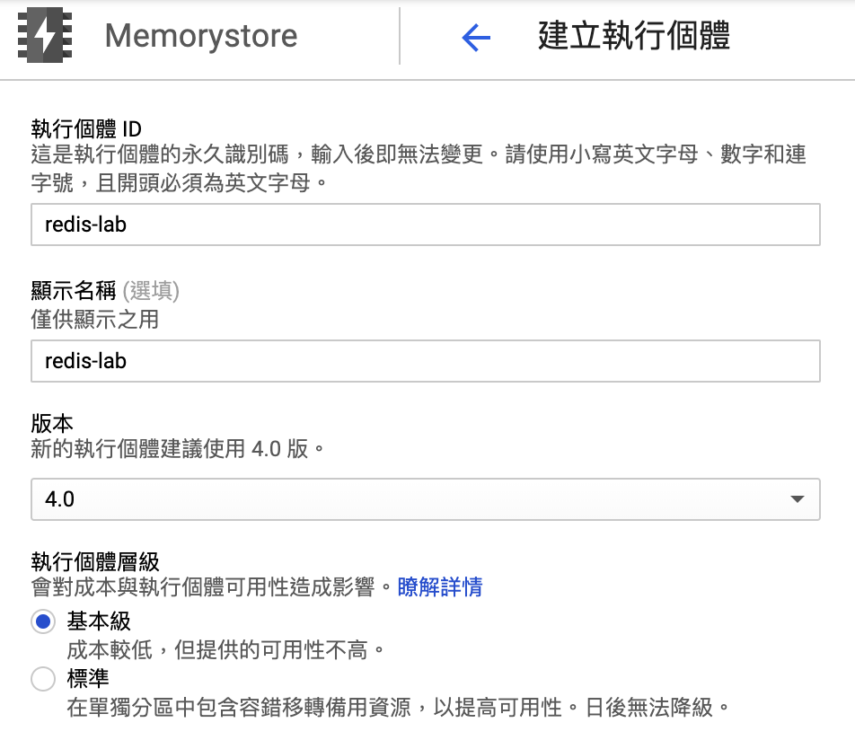
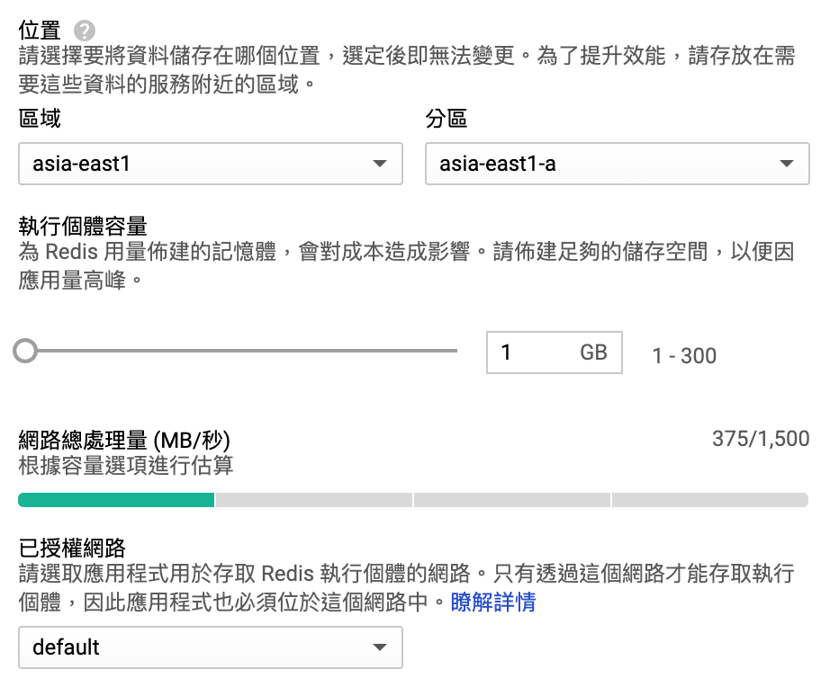
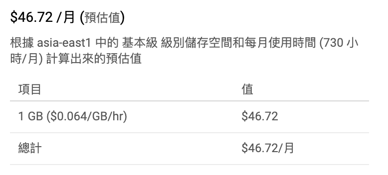

# GCP Memorystore 服務介紹

此篇來說說 Memorystore ～

Memorystore 是 GCP 針對 Redis 提供的線上代管服務。當您的環境不是自建 Redis 服務情況下，可直接選用此服務，作為儲存 Key/Value 型態資料來支撐您的後端應用服務。

## 建立 Redis 個體

針對自己需求而自訂 Redis 資源，如下所示：

### 關於 執行個體層級

除了基本名稱與版本選擇\(主流 4.0版，另有 3.2版\)，最重要的是選擇`[執行個體層級]`  
這兩項有哪些差別呢？

最大的差別在於，可否**跨地域複製**與**自動容錯移轉**，來達到**高可用性服務等級**。  
如您的環境有要求 高可用性服務等級，除了選擇標準版之外，仍須深入探究 GCP 容錯移轉的觸發時機，如何驗證、如何確保高可用。


更詳盡 redis-tiers 資訊，請參考 GCP 官方說明頁：[連結](https://cloud.google.com/memorystore/docs/redis/redis-tiers)


### 關於地區位置、容量

原則上，**區域**與**分區** 是選擇與您的 _後端服務_ 相同地區為優先。才不會變成跨地域性、增加耗時的存取 Redis 服務。

執行個體容量，牽涉到您的 key / value 資料量，初期可以 1~3GB開始使用，後續再視情況追加。

資源容量另有牽涉到 Redis 網路效能，這非常建議需要透過壓力測試，找出適合服務上線時所需的資源容量與所需的網路效能。

### 計價成本

Memorystore Redis 服務主要成本，會基於上面所選擇的「執行個體層級」、「區域與分區」影響著每單位成本。  
至於 容量，使用的容量 \(網路效能\) 越高，單位成本越低。  
所以估算出合理需求的資源容量 \(網路效能\) 是有必要。畢竟成本是影響著營收比。


關於計價說明，參考官方此[連結](https://cloud.google.com/memorystore/pricing)


