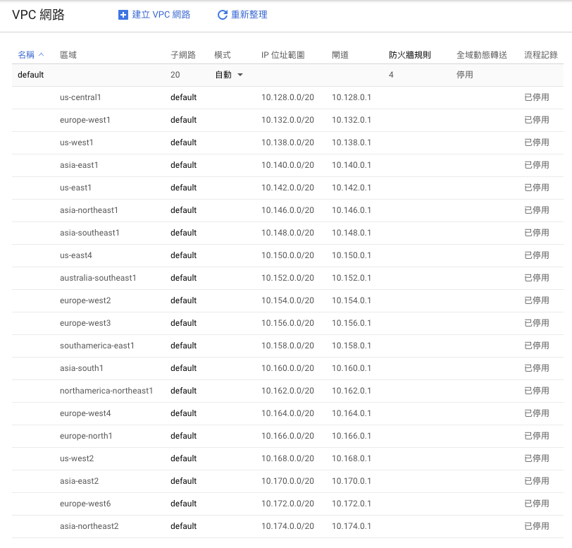

# 關於 GCP VPC 網路

我們都知道，電腦資訊的時代背後缺少不了網路，何況是雲端中的服務。  
GCP 雲平台的基礎網路服務名稱為：虛擬私人雲端 \(VPC\)  
此服務提供 [Compute Engine](https://cloud.google.com/compute/docs/) 虛擬機器 \(VM\) 執行個體、[GKE](https://cloud.google.com/kubernetes-engine/docs/) 容器及 [App Engine 彈性環境](https://cloud.google.com/appengine/docs/flexible/)網路功能。

在一個GCP專案下，虛擬私人雲端 \(VPC\)可以這樣的想像  
最大單位是 "名稱"，可想像成一個 Local LAN。  
次級單位是 "子網路"，想像成一個 VLAN。

最大單位僅僅以一個名稱作為定義，預設名稱是：default  
您可以再新增多個獨立唯一性名稱，每個之間，是個別獨立的，無法直接相互連線。  
如下圖所示：

每個 "子網路" 有個別的 CIDR 範圍以及隸屬的地區，相同地區的子網路，是可以相互連線。  
預設的`default`個別 "子網路"、"地區" 網路示意如下：

因個人仍在學習 VPC，僅用些許實務經驗與認知，而未採用官方的說明做為解說，所以用自己的語言來表達，如有不懂之處，仍以官方文件為主，懇請讀者見諒。

後續我會介紹，建立`GKE pod`、`Cloud SQL`、`Memorystore`，透過**VPC**網路服務下，達到服務相互串接的情境。

