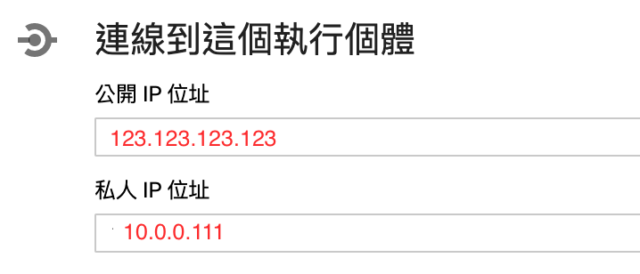
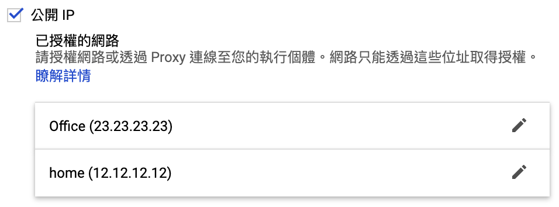

# 如何連線至 Cloud SQL

前一篇建立Cloud SQL服務後，不外乎主要給予應用程式進行資料交易、儲存DB資料。  
應用程式可以部署於`GCP Compute Engine`或者`Kubernetes GKE`等等平台上，皆可透過`Cloud SQL 私人IP` 進行連線，這部分會牽涉到`GCP VPC`網路，以及針對主題 **GKE pod** 如何連線至`Cloud SQL` 皆會介紹。

## 開發者連線至 Cloud SQL

### 1. Cloud SQL 連線資訊

回顧上一篇，建立`Cloud SQL`執行個體時，皆啟用`公開IP`與`私人IP`，GCP服務就會配發相對的 IP 給予連線使用。如下圖：



### 透過 公開IP 連線

透過公開IP，開發者即可使用 SQL工具軟體、指令方式連線至`Cloud SQL`執行個體。

> 使用公開IP方式連線，非常有必要設定`已授權的網路`功能，意即限制連線來源IP。



### 透過 私人IP 連線

此連線管道，就運用到gcloud工具指令，如下：

```bash
gcloud compute ssh redis-forwarder --zone asia-east1-b -- -N -L 3306:10.0.0.111:3306
```

此處沿用前篇已經建立的`redis-forwarder`作為連線跳板，`--zone`必須指定 **compute** 所在地區。

開發者即可透過`私有IP`+`gcloud`建立安全連線後，使用本機上 SQL 工具軟體、指令方式連線至`Cloud SQL`執行個體執行業務工作。

