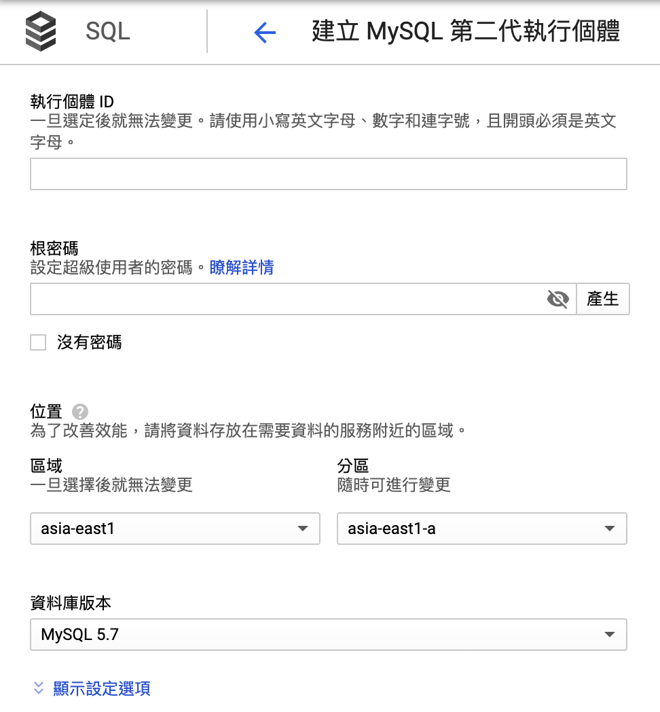
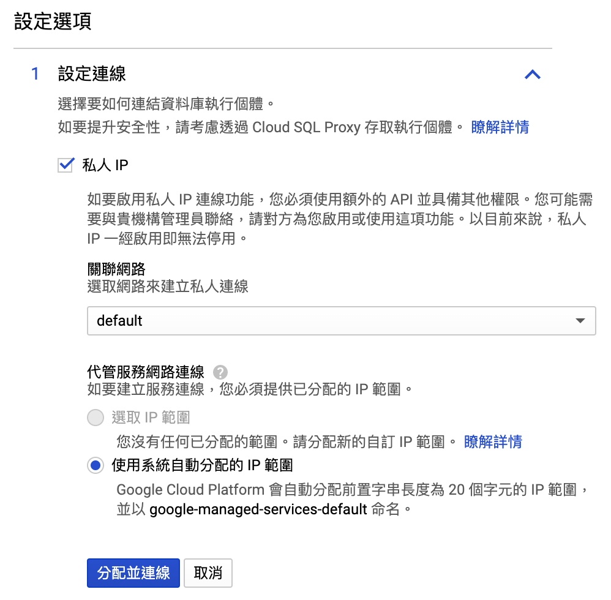
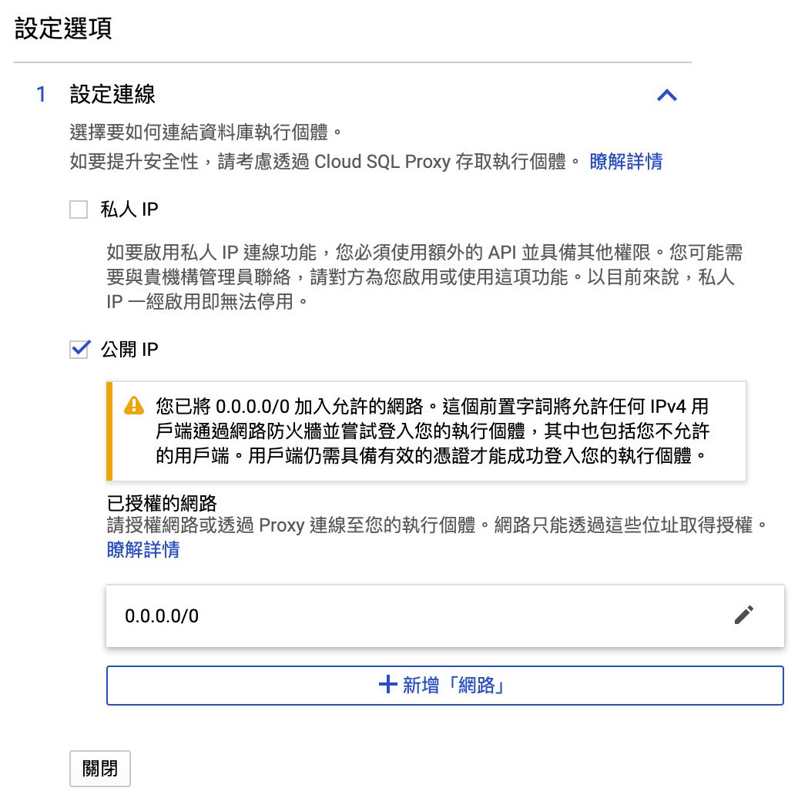
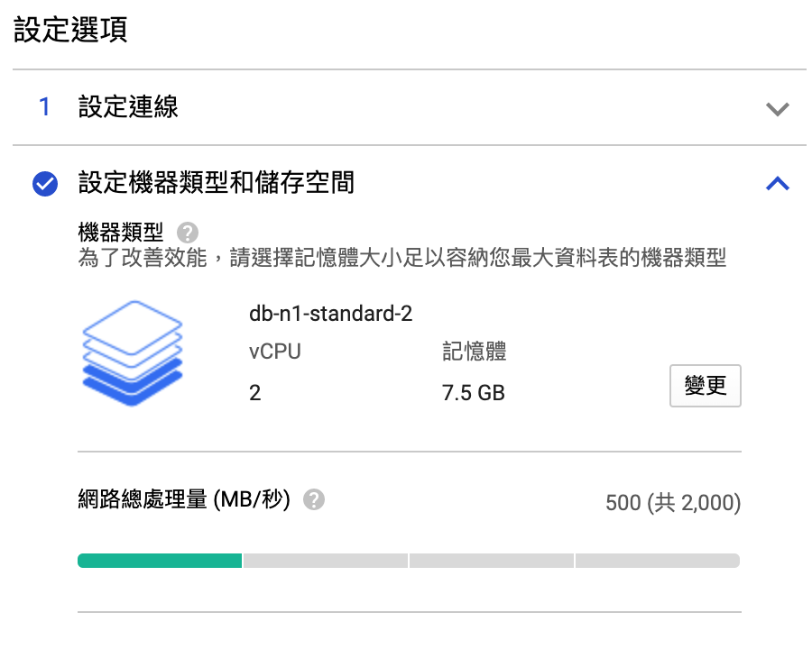
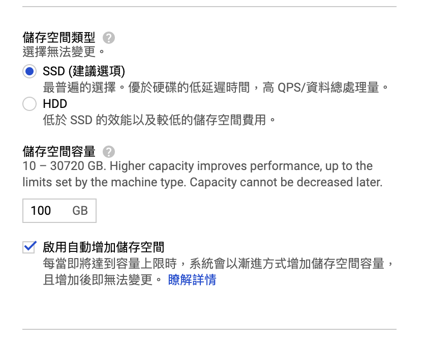
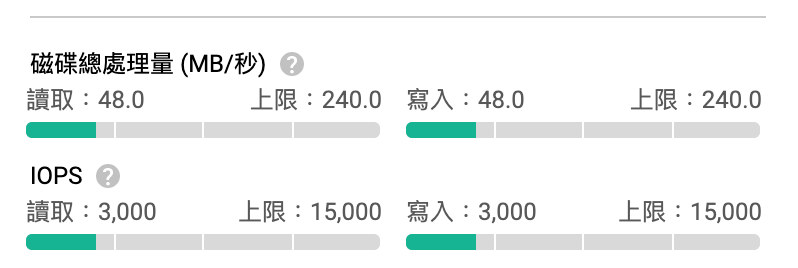
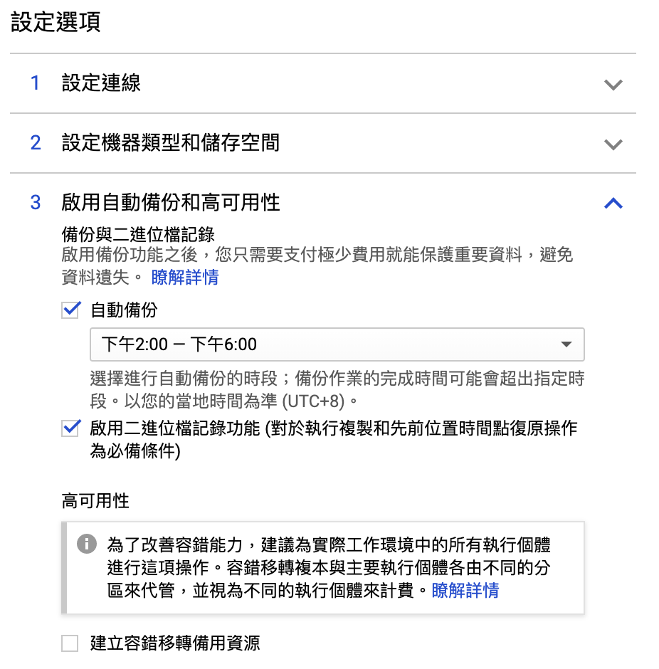
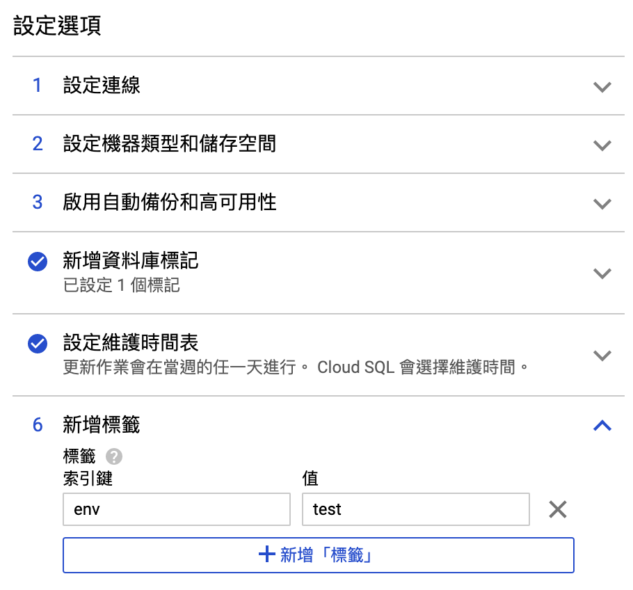

# GCP Cloud SQL 服務介紹

如同前兩篇提到的 Memorystore Redis 服務代管業務，`Cloud SQL` 就是 GCP 上關聯式資料庫的服務代管業務。  
目前此業務，有兩種資料庫可以選：`MySQL、PostgreSQL`

> 因為我個人僅使用過`MySQL`項目，以下僅以`MySQL`作為說明。

### 建立 MySQL 執行個體

建立MySQL執行個體，除了必要的root密碼之外，重要的`位置`不可挑錯，原則上是與您的應用服務相同**區域**與**分區**。  
關於資料庫版本，目前僅支援`5.6`與`5.7`兩種選擇，尚未支援`MySQL 8.0`版本。

### 設定選項

#### 1. 設定連線

如下兩張圖所示，連線可分為`私人IP、公開IP`，這與前篇 **Memorystore** 連線IP僅局限內網`10.0.0.0/8`有所不同。

> 關於`私人IP`選單中的`關聯網路` 其中的細節牽涉到GCP網路功能：VPC 網路  
> 會於另外一篇文章中說明。

設定了`私人IP`有其好處的，可讓您的應用服務與資料庫之間的資料交易，無需暴露在公網上。

勾選`公開IP`是預設選項，也可以取消勾選僅使用`私有IP`網路服務。  
當勾選使用`公開IP`時，是需要再設定允許進行資料交易的`已授權的網路`\(來源IP\)，否則仍是無法完成資料庫連線。

> 圖片中`0.0.0.0/0`是額外手動設定的，並非預設設定。

### 

### 機器類型與儲存空間

#### 機器類型、網路總處理量

#### 

#### 儲存空間類型、容量

#### 關於 磁碟總處理量

### 自動備份和高可用性

### 資料庫標記

### 維護時間

### 新增標籤

