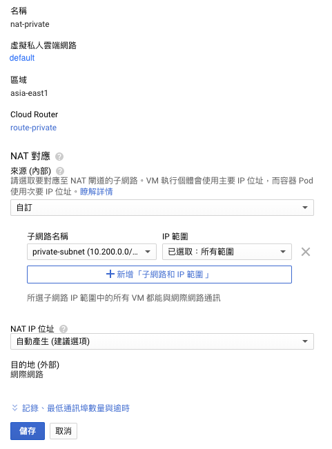
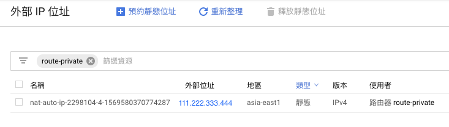

# P3

我面對的需求是，GKE裡頭的pod，當對外進行API連線存取時，需要固定我們環境的來源公開網路IP，方可迎合對方API限制訪問政策。

經過朋友介紹在GCP服務中，找到Cloud NAT功能。

## Cloud NAT介紹

Cloud NAT 讓 VM 執行個體和容器 Pod 透過共用的公開 IP 位址與網際網路進行通訊。

Cloud NAT 使用 NAT 閘道來管理這些連線，NAT 閘道僅限特定地區和 VPC 網路使用。如果您在多個地區中皆有 VM 執行個體，就必須為每個地區建立 NAT 閘道。

環境準備：

* VPC網路
* GKE Cluster 環境
* * shell-demo pod
* curl

## 建立 NAT Gateway

### 建立細節

設定名稱、選擇相對應的VPC網路、地區、路由器\(Cloud Router\)

#### 建立Cloud Router


#### NAT 對應

建立完成如下



查看VPC網路 - 外部IP位址



透過pod內指令，驗證上網存取連線所帶的IP。

```text
kubectl exec -it shell-demo -- curl httpbin.org/ip
```

