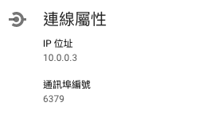

# 如何連線至 GCP Memorystore

上一篇提到在 GCP**`Memorystore`**的服務中建立 Redis 執行個體，建立後當然需要使用它，此篇來說明如何讓應用程式使用 Redis 服務，後面再說明如何從開發者、維運人員之本機上連線至 Redis 服務。

### Redis 網路連線屬性

如下圖所示，GCP Memorystore Redis 服務僅提供內部網路 IP 網段。

